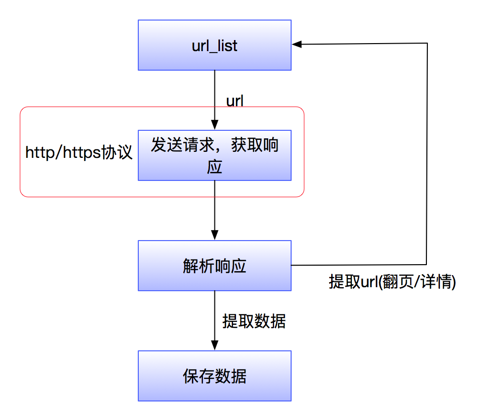

# http协议复习

* 掌握 http以及https的概念和默认端口
* 掌握 爬虫关注的请求头和响应头
* 了解 常见的响应状态码
* 理解 浏览器和爬虫爬取的区别

## 1. http以及https的概念和区别

> HTTPS比HTTP更安全，但是性能更低

* HTTP：超文本传输协议，默认端口号是80
  * 超文本：是指超过文本，不仅限于文本；还包括图片、音频、视频等文件
  * 传输协议：是指使用共用约定的固定格式来传递转换成字符串的超文本内容
* HTTPS：HTTP + SSL(安全套接字层)，即带有安全套接字层的超本文传输协，默认端口号：443
  * SSL对传输的内容（超文本，也就是请求体或响应体）进行加密
* 可以打开浏览器访问一个url，右键检查，点击net work，点选一个url，查看http协议的形式

## 2. 爬虫特别关注的请求头和响应头

### **2.1 特别关注的请求头字段**

> http请求的形式如上图所示，爬虫特别关注以下几个请求头字段

* Content-Type
* Host (主机和端口号)
* Connection (链接类型)
* Upgrade-Insecure-Requests (升级为HTTPS请求)
* **User-Agent** (浏览器名称)
* **Referer** (页面跳转处)
* **Cookie** (Cookie)
* Authorization(用于表示HTTP协议中需要认证资源的认证信息，如前边web课程中用于jwt认证)

> 加粗的请求头为常用请求头，在服务器被用来进行爬虫识别的频率最高，相较于其余的请求头更为重要，但是这里需要注意的是并不意味这其余的不重要，因为有的网站的运维或者开发人员可能剑走偏锋，会使用一些比较不常见的请求头来进行爬虫的甄别

### **2.2 特别关注的响应头字段**

> http响应的形式如上图所示，爬虫只关注一个响应头字段

* Set-Cookie （对方服务器设置cookie到用户浏览器的缓存）

## 3 常见的响应状态

* 200：成功
* 302：跳转，新的url在响应的Location头中给出
* 303：浏览器对于POST的响应进行重定向至新的url
* 307：浏览器对于GET的响应重定向至新的url
* 403：资源不可用；服务器理解客户的请求，但拒绝处理它（没有权限）
* 404：找不到该页面
* 500：服务器内部错误
* 503：服务器由于维护或者负载过重未能应答，在响应中可能可能会携带Retry-After响应头；有可能是因为爬虫频繁访问url，使服务器忽视爬虫的请求，最终返回503响应状态码

我们在学习web知识的时候就已经学过了状态码的相关知识，我们知道这是服务器给我的相关反馈，我们在学习的时候就被教育说应该将真实情况反馈给客户端，但是在爬虫中，可能该站点的开发人员或者运维人员为了阻止数据被爬虫轻易获取，可能在状态码上做手脚，也就是说返回的状态码并不一定就是真实情况，比如:服务器已经识别出你是爬虫，但是为了让你疏忽大意，所以照样返回状态码200，但是响应体重并没有数据。

**所有的状态码都不可信，一切以是否从抓包得到的响应中获取到数据为准**

## 4. 浏览器运行过程

\

**4.1 http请求的过程**

1. 浏览器在拿到域名对应的ip后，先向地址栏中的url发起请求，并获取响应
2. 在返回的响应内容（html）中，会带有css、js、图片等url地址，以及ajax代码，浏览器按照响应内容中的顺序依次发送其他的请求，并获取相应的响应
3. 浏览器每获取一个响应就对展示出的结果进行添加（加载），js，css等内容会修改页面的内容，js也可以重新发送请求，获取响应
4. 从获取第一个响应并在浏览器中展示，直到最终获取全部响应，并在展示的结果中添加内容或修改————这个过程叫做浏览器的**渲染**

**4.2 注意:**

但是在爬虫中，爬虫只会请求url地址，对应的拿到url地址对应的响应（该响应的内容可以是html，css，js，图片等）

浏览器渲染出来的页面和爬虫请求的页面很多时候并不一样，是因为爬虫不具备渲染的能力（当然后续课程中我们会借助其它工具或包来帮助爬虫对响应内容进行渲染）

* **浏览器最终展示的结果是由多个url地址分别发送的多次请求对应的多次响应共同渲染的结果**
* **所以在爬虫中，需要以发送请求的一个url地址对应的响应为准来进行数据的提取**

## &#x20;5. 关于http协议的其它参考阅读 

* [https://blog.csdn.net/qq\_33301113/article/category/6943422/2](https://blog.csdn.net/qq\_33301113/article/category/6943422/2)
* [https://www.xuebuyuan.com/3252125.html](https://www.xuebuyuan.com/3252125.html)
* [https://baike.baidu.com/item/http/243074?fr=aladdin](https://baike.baidu.com/item/http/243074?fr=aladdin)
* [https://www.jianshu.com/p/cc1fea7810b2](https://www.jianshu.com/p/cc1fea7810b2)
* [https://blog.csdn.net/qq\_30553235/article/details/79282113](https://blog.csdn.net/qq\_30553235/article/details/79282113)
* [https://segmentfault.com/q/1010000002403462](https://segmentfault.com/q/1010000002403462)
